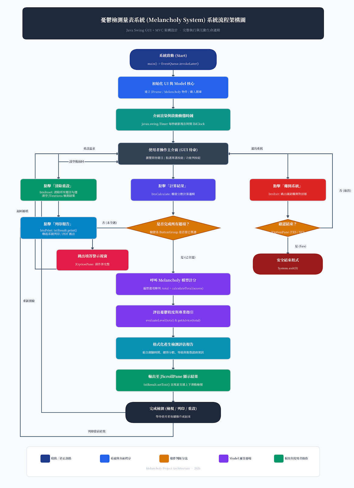

# 憂鬱檢測量表系統 (Melancholy Assessment System)

## 1. 專案簡介

[簡介說明](doc/Melancholy_Project_Workflow2.md)




本專案為一套基於 Java Swing GUI 視窗框架開發的「台灣人憂鬱症自我檢測量表」桌面應用程式。該系統旨在提供使用者一個直覺、友善且具互動性的心理健康檢測工具。透過量表問卷評估個人的心理與情緒狀態，並自動計算量表總分與對應之身心狀況等級，輔助使用者及早發現潛在的情緒困擾與憂鬱傾向，適時尋求專業心理諮商或醫療資源協助。

## 2. 學習目標
1. **物件導向設計原則（OOP）**：實踐封裝（Encapsulation）、類別責任劃分與職責分離（Model 與 View/Controller 架構概念）。
2. **Java 基礎語法運用**：熟練掌握 Primitive Types（數值、布林）、條件分支判斷（`if-else`）、迴圈結構（`for`、`while`）及常數（`final`）定義。
3. **陣列（Array）結構與操作**：利用陣列儲存題目內容、選項分數與文字對應，簡化迴圈計算並減少冗餘程式碼。
4. **GUI 視窗介面開發**：掌握 Java Swing 核心元件（`JFrame`、`JPanel`、`JRadioButton`、`ButtonGroup`、`JButton`、`JTextArea`、`JScrollPane`、`JLabel`）之排版與層次設計。
5. **事件驅動程式設計（Event Handling）**：熟悉 `ActionListener` 介面與事件監聽註冊機制，處理按鈕觸發、輸入重置、離開視窗及報表輸出等操作。
6. **執行緒與時間機制（Thread / Timer）**：運用定時器或多執行緒更新介面即時動態時鐘（Clock Display），提升桌面程式動態互動體驗。

## 3. 開發環境
* **作業系統**：Windows 10 / 11、macOS 或 Linux
* **JDK 版本**：Java Development Kit (JDK) 11 (LTS)
* **開發工具 (IDE)**：Eclipse IDE for Java Developers (搭配 WindowBuilder 外掛)
* **編碼設定**：UTF-8 (確保中文題目與評語無亂碼)
* **建置機制**：標準 Eclipse Java Project (相容於 CLI `javac` 與 `java` 指令)

## 4. 使用技術
* **核心語言**：Java SE 11
* **圖形介面函式庫**：Java Swing (`javax.swing.*`) 與 AWT (`java.awt.*`)
* **事件監聽機制**：`java.awt.event.ActionListener`、`java.awt.event.ActionEvent`
* **時間與計時**：`javax.swing.Timer` 或 `java.util.Date` / `java.text.SimpleDateFormat`
* **報表輸出機制**：Java AWT 列印 API (`java.awt.print.*`) 或 Swing 內建 `JTextComponent.print()` 方法

## 5. 核心功能
1. **量表問卷互動答題**：提供標準量表評估題目，每題搭配單選按鈕組（Radio Buttons），確保單題單選且互斥。
2. **動態介面時鐘**：視窗頂部或狀態列具備即時動態時鐘，精確顯示目前日期、時間與星期。
3. **自動計分與等級判定**：
   * 勾選完成後按下「計算/檢測」按鈕，系統自動逐題統計總分。
   * 根據總分區間輸出評語診斷（如：情緒良好、輕度情緒困擾、中度憂鬱傾向、重度憂鬱傾向需就醫）。
4. **結果檢視與捲動軸支援**：檢測結果輸出至附有垂直與水平捲動軸（`JScrollPane`）的多行文字區域（`JTextArea`），方便瀏覽診斷明細。
5. **快速重設（Reset）**：一鍵清空所有選項與歷史檢測紀錄，重設元件至初始狀態。
6. **報表列印/匯出（Print）**：支援列印當前評估報告與分數清單，便於實體歸檔或就醫參考。
7. **系統安全退出（Exit）**：提供明確的關閉視窗確認對話框，安全結束應用程式。

## 6. 系統流程
```text
[啟動程式 Main]
       │
       ▼
[初始化 Model (Melancholy) & UI (MelancholyUI)]
       │
       ▼
[啟動即時時鐘 Timer，渲染主視窗畫面]
       │
       ├─────────────────────────────────────────────────┐
       ▼                                                 ▼
[使用者填寫問卷選項]                             [使用者操作輔助功能]
       │                                                 │
       ▼                                                 ├─► [點擊重設 (Reset)] ──► 清空選項與輸出
[點擊計算結果 (Calculate)]                               │
       │                                                 ├─► [點擊列印 (Print)] ──► 呼叫列印對話框
       ▼                                                 │
[驗證是否每題皆有勾選]                                   └─► [點擊離開 (Exit)]  ──► 安全確認並退出
       ├─► (未完成) ──► 跳出警示對話框提示補齊題目
       │
       ▼ (完成)
[呼叫 Melancholy 模型進行加總計分]
       │
       ▼
[依總分區間進行 if-else 分級評估]
       │
       ▼
[格式化產生檢測報告文字]
       │
       ▼
[更新並顯示於 JScrollPane 包裹的 JTextArea 中]
```

## 7. 專案結構
```text
Melancholy/
├── .classpath                         # Eclipse 類別路徑設定檔
├── .project                           # Eclipse 專案設定檔
├── .settings/                         # Eclipse 偏好設定目錄
│   ├── org.eclipse.core.resources.prefs # 編碼設定 (UTF-8)
│   └── org.eclipse.jdt.core.prefs     # Java 編譯等級設定
├── bin/                               # 編譯產生之 .class 位元組碼目錄
│   └── com/
│       ├── Melancholy.class           # 模型編譯檔
│       ├── MelancholyUI.class         # 介面/控制層主類別編譯檔
│       └── MelancholyUI$1..8.class    # 事件監聽器內部匿名類別 (Anonymous Classes)
└── src/                               # Java 原始程式碼目錄
    └── com/
        ├── Melancholy.java            # 商業邏輯與資料運算模型 (Model)
        └── MelancholyUI.java          # 視窗介面佈局與事件處理控制 (View & Controller)
```

## 8. Class 說明
1. **`com.Melancholy`**：
   * **職責**：商業邏輯模型（Model）。專注於量表資料結構封裝、分數累加演算法、問卷常數定義以及分數等級判定規則。不依賴任何 GUI 視窗元件，便於單元測試（Unit Test）。
2. **`com.MelancholyUI`**：
   * **職責**：視窗介面與互動控制層（View & Controller 整合設計）。負責建構視窗版面配置、註冊各類按鈕之事件監聽器（Action Listeners）、驅動介面即時動態時鐘、收集使用者輸入資料並調用 `Melancholy` 物件完成計分與顯示。

## 9. Field 說明

### `Melancholy` 類別欄位
* `private int totalScore`：儲存當前問卷測驗所得的總分數。
* `private int[] scores`：儲存各題選項對應分數的整數陣列。
* `private String resultLevel`：紀錄依據總分評估後之心理健康狀況等級字串。
* `private String advice`：紀錄針對該等級所建議的行動指引或醫學衛教資訊。

### `MelancholyUI` 類別欄位
* `private JFrame frame`：主應用程式視窗本體。
* `private JLabel lblClock`：即時顯示目前系統日期的標籤元件。
* `private JRadioButton[][] radioButtons`：二維選項按鈕陣列，管理各題的選項元件。
* `private ButtonGroup[] buttonGroups`：單選按鈕群組陣列，保證每一道題目各選項之互斥性。
* `private JButton btnCalculate`：觸發計算總分與評估之按鈕。
* `private JButton btnReset`：觸發重新填寫與重設畫面之按鈕。
* `private JButton btnPrint`：觸發列印或輸出報告之按鈕。
* `private JButton btnExit`：觸發關閉程式之按鈕。
* `private JTextArea txtResult`：顯示檢測結果明細與建議的多行文字框。
* `private JScrollPane scrollPane`：包裝 `txtResult` 提供上下捲動檢視功能的捲軸容器。
* `private javax.swing.Timer timer`：驅動動態時鐘每秒更新的時間觸發計時器。

## 10. Constructor 說明

### `Melancholy()`
* **語法**：`public Melancholy()`
* **說明**：初始化量表模型物件，將累計分數歸零，配置評分區間預設值。

### `Melancholy(int[] answers)`
* **語法**：`public Melancholy(int[] answers)`
* **說明**：多載建構子，接收包含各題得分的整數陣列，直接初始化並觸發內部評估計分程序。

### `MelancholyUI()`
* **語法**：`public MelancholyUI()`
* **說明**：建構 UI 視窗與元件。設定視窗標題、大小、關閉行為（`EXIT_ON_CLOSE`）、初始化版面配置管理器（Layout Managers）、掛載各題控制項、建立按鈕群組並啟動動態時鐘定時器。

## 11. Method 說明

### `Melancholy` 核心方法
1. `public void setScores(int[] scores)`：設定各題目所得分數陣列。
2. `public int calculateTotal()`：遍歷陣列計算並回傳所有題目分數之總和。
3. `public String evaluateLevel(int total)`：依據總分落點，回傳對應的憂鬱指數等級字串。
4. `public String getAdvice(int total)`：依據總分回傳相對應之衛教建議與專業求助指引。
5. `public void reset()`：重設所有分數資料至初始零值。

### `MelancholyUI` 核心方法
1. `public static void main(String[] args)`：程式進入點，透過 `EventQueue.invokeLater()` 以 EDT 執行緒安全啟動視窗。
2. `private void initialize()`：組裝與渲染所有 Swing 介面元件。
3. `private void startClock()`：建立 `javax.swing.Timer`，每 1000 毫秒獲取系統時間並更新 `lblClock`。
4. `private void handleCalculate()`：驗證所有題號是否完成選擇，呼叫 `Melancholy` 計算並將結果寫入 `txtResult`。
5. `private void handleReset()`：清除二維選項勾選狀態（`clearSelection()`），清空結果文字框。
6. `private void handlePrint()`：呼叫 `txtResult.print()` 啟動系統標準列印介面。
7. `private void handleExit()`：跳出確認視窗，使用者確認後調用 `System.exit(0)`。

## 12. OOP 重點
* **封裝性（Encapsulation）**：資料欄位皆設為 `private`，透過 `getter` 與 `setter` 或專屬業務方法進行存取，避免外部 UI 直接污染或竄改核心計分規則。
* **高內聚低耦合（High Cohesion & Low Coupling）**：UI 介面不包含任何硬編碼的醫學評分門檻，由獨立的 `Melancholy` 類別統籌計分與等級裁定。
* **關注點分離（Separation of Concerns）**：呈現邏輯（View/Controller）與量表計算運算（Model）分屬不同類別，未來更換題目或門檻時無需改動 UI 佈局。

## 13. Array / Collection 說明
* **一維字串陣列（題目清單）**：`String[] questions` 儲存問卷所有題目的文字描述，使用 `for` 迴圈動態產出問卷 UI。
* **二維元件陣列**：`JRadioButton[題目數][選項數]` 方便藉由巢狀迴圈（Nested Loops）統一管理題目元件建立與選項取值。
* **一維分數陣列**：`int[] selectedScores` 依題目索引依序紀錄各題得分，並直接送入計分模型計算。

## 14. GUI 元件
| 元件類別 | 元件名稱 | 用途說明 |
| :--- | :--- | :--- |
| `JFrame` | 主視窗 | 桌面程式主容器，設定視窗大小與置中展示 |
| `JPanel` | 內容容器面板 | 劃分頂部資訊區、中間題目滾動區與底部按鈕面板 |
| `JLabel` | 標題與時鐘標籤 | 呈現量表名稱、指示標語及每秒動態更新之時間 |
| `JRadioButton` | 選項按鈕 | 提供「沒有或極少」、「有時候」、「常常」、「總是」四種單選項目 |
| `ButtonGroup` | 單選互斥群組 | 確保每一題內的四個 RadioButton 只能單選一項 |
| `JButton` | 控制按鈕 | 包含「計算分數」、「清除重設」、「列印結果」、「結束離開」四顆功能鍵 |
| `JTextArea` | 結果文字區塊 | 完整呈現檢測得分、診斷等級及建議求助專線 |
| `JScrollPane` | 捲軸滾動面板 | 包覆問卷內容與結果面板，防止視窗內容過長產生溢出 |

## 15. Event Handling
本系統主要運用事件監聽機制處理使用者行為：
1. **匿名內部類別（Anonymous Inner Class）實作**：
   ```java
   btnCalculate.addActionListener(new ActionListener() {
       @Override
       public void actionPerformed(ActionEvent e) {
           handleCalculate();
       }
   });
   ```
2. **Lambda 表示式（JDK 8+ 簡化語法）**：
   ```java
   btnExit.addActionListener(e -> handleExit());
   ```
3. **Timer 事件驅動**：
   `javax.swing.Timer` 定時發出 `ActionEvent`，監聽器即時更新時鐘標籤文字。

## 16. 輸入資料
量表標準題目共包含多道評估項目（以台灣常用情緒評估量表為範本），每一題提供 4 個級距評分：
* `0 分`：沒有或極少（每週少於 1 天）
* `1 分`：有時候（每週約 1~2 天）
* `2 分`：常常（每週約 3~4 天）
* `3 分`：總是（每週約 5~7 天）

## 17. 計算邏輯
1. **加總公式**：
   $$	ext{Total Score} = \sum_{i=1}^{n} 	ext{Score}_i$$
2. **級距切分規則（範例標準）**：
   * **0 ~ 8 分**：情緒狀態良好，心理適應適當。
   * **9 ~ 14 分**：輕度情緒困擾，建議多運動、維持作息正常、找親友傾訴。
   * **15 ~ 28 分**：中度情緒困擾，具有明顯憂鬱情緒，建議尋求學校諮商中心或身心科評估。
   * **29 分以上**：重度情緒困擾與強烈憂鬱傾向，強烈建議立即至醫療院所身心科就醫尋求專業診治。

## 18. 輸出結果
檢測報告格式化輸出於 `JTextArea`：
```text
==================================================
              心理健康檢測量表 評估報告
==================================================
測驗時間：2026-09-17 17:09:08
完成題數：全數完成 (共 10 題)
總分累計：18 分
評定等級：【中度情緒困擾】
專業建議：
  您目前正面臨較為顯著的情緒壓力與中度憂鬱傾向。
  建議您給自己適度休息放鬆的時間，並可撥打安心專線 1925
  或預約專業心理諮商師、身心科醫師進行深度會談與評估。
==================================================
```

## 19. 範例執行結果
* **情境一：低分狀態**
  * 題目均選 0~1 分，總計 5 分。
  * 輸出：「身心狀況良好，請繼續保持積極正向之生活節奏。」
* **情境二：未作答完整即送出**
  * 第 4 題未勾選任何選項。
  * 彈出 `JOptionPane.showMessageDialog` 提示：「您尚有第 4 題未作答，請完成所有題目後再行計算！」

## 20. 執行方式
### 於 Eclipse IDE 中執行
1. 將專案匯入（Import）至 Eclipse 工作空間。
2. 確認 Project Properties 的 Java Build Path 為 JDK 11。
3. 找到 `Melancholy/src/com/MelancholyUI.java`。
4. 點選右鍵選擇 `Run As` -> `Java Application`。

### 透過命令列編譯與執行
```bash
# 切換至專案根目錄
cd Melancholy

# 編譯 Java 程式碼至 bin 目錄
javac -encoding UTF-8 -d bin src/com/*.java

# 執行主程式
java -cp bin com.MelancholyUI
```

## 21. 操作方式
1. **啟動視窗**：檢視畫面頂部確認目前時間是否正常跳動。
2. **作答**：依據最近一週的真實感受，逐題勾選最適選項。
3. **計算**：點擊「計算結果」按鈕，滾動檢視下方結果欄之得分與建議。
4. **列印**：若需書面紀錄，點選「列印報告」選擇印表機或輸出為 PDF。
5. **重設**：若欲重新評估或供他人施測，點選「清除重設」。
6. **離開**：完成後點選「離開系統」，確認對話框後安全退出。

## 22. 重要程式碼

### `Melancholy.java` 運算與等級判斷
```java
package com;

public class Melancholy {
    private int totalScore;

    public int calculateTotal(int[] scores) {
        int sum = 0;
        for (int s : scores) {
            sum += s;
        }
        this.totalScore = sum;
        return sum;
    }

    public String evaluateLevel(int score) {
        if (score <= 8) {
            return "情緒狀態良好";
        } else if (score <= 14) {
            return "輕度情緒困擾";
        } else if (score <= 28) {
            return "中度情緒困擾，具憂鬱傾向";
        } else {
            return "重度情緒困擾，強烈建議就醫診斷";
        }
    }
}
```

### `MelancholyUI.java` 動態時鐘實作
```java
private void startClock() {
    javax.swing.Timer timer = new javax.swing.Timer(1000, new java.awt.event.ActionListener() {
        @Override
        public void actionPerformed(java.awt.event.ActionEvent e) {
            java.text.SimpleDateFormat sdf = new java.text.SimpleDateFormat("yyyy-MM-dd HH:mm:ss");
            lblClock.setText("現在時間：" + sdf.format(new java.util.Date()));
        }
    });
    timer.start();
}
```

## 23. 常見錯誤
1. **`NullPointerException`**：遍歷按鈕時未妥善檢查未選中項目（`getSelectedToggle()` 回傳 null），直接取出分數導致空指標例外。
2. **中文亂碼問題**：在非 UTF-8 環境編譯未指定 `-encoding UTF-8`，造成介面題目出現亂碼。
3. **按鈕未互斥（可複選）**：忘記將各題的 `JRadioButton` 加入同一個 `ButtonGroup` 中，造成同一題可同時勾選多個選項。
4. **EDT 執行緒阻塞**：將長時間計算或耗時作業放在 Swing 事件分派執行緒中，導致視窗卡頓凍結。

## 24. Debug 重點
* 驗證各單選按鈕群組在重新選取時能否正確取消前一項勾選。
* 測試當題數全部選擇最高分（滿分）與全部選擇最低分（0分）時，邏輯分支邊界值判定是否精準。
* 觀察「清除重設」按鈕是否連同所有 RadioButton 的選中狀態與結果顯示區域一併清空。
* 檢查結果區域是否套用 `JScrollPane`，並測試大量文字時滾動軸是否正常運作。

## 25. 練習題
1. **題號未答提示**：修改程式碼，當有點擊計算但某題未填寫時，精確提示「未填寫之所有題號清單」並自動聚焦至該題目。
2. **進度條顯示（JProgressBar）**：加入 `JProgressBar` 元件，即時顯示使用者當前問卷填答完成度百分比（如：80%）。
3. **題目隨機排序**：使用 `Collections.shuffle()` 練習將題目順序打亂，測試模型與 UI 間的動態繫結。

## 26. 進階延伸
* **資料持久化（Database / File I/O）**：透過 JDBC 將測驗者的姓名、時間與得分儲存至 MySQL / SQLite 資料庫，或匯出成 CSV / Excel 報表。
* **歷史趨勢圖表繪製**：整合 JFreeChart 函式庫，將歷次測驗結果繪製成折線圖，追蹤個人心理狀況起伏趨勢。
* **多國語言支援（I18N）**：運用 Java `ResourceBundle` 與屬性檔（`messages_zh.properties`、`messages_en.properties`），實作中英文一鍵切換。

## 27. 適合對象
* 剛學完 Java 基礎語法與 OOP 物件導向觀念，欲實踐視窗專案的初學者。
* 正在學習 Java Swing GUI 元件佈局與事件處理機制的學生或自學者。
* 欲了解 Model-View-Controller (MVC) 模組化設計理念的程式設計師。

## 28. 先備知識
* Java 基本型態（int, boolean, String 等）、運算子與基本控制流程。
* 物件導向基礎（類別定義、物件生成、方法呼叫、封裝概念）。
* 基礎一維與二維陣列（Array）操作。
* 認識基本的視窗介面架構與常見事件處理機制。

## 29. 完成後能力
* 能獨立使用 Java Swing 元件與佈局管理器打造美觀且功能齊全的桌面應用程式。
* 掌握多元件（Radio Buttons, ButtonGroup, TextArea, ScrollPane）之互動與資料取值。
* 具備使用 `Timer` 結合執行緒開發動態時鐘與即時介面更新的能力。
* 具備將商業邏輯與介面控制妥善解耦的程式架構規劃思維。

## 30. 版本資訊
* **專案版本**：v1.0.0
* **建立日期**：2026-09
* **授權協議**：MIT License / 學習實作專案
* **技術支援與維護**：Melancholy Project Development Team
