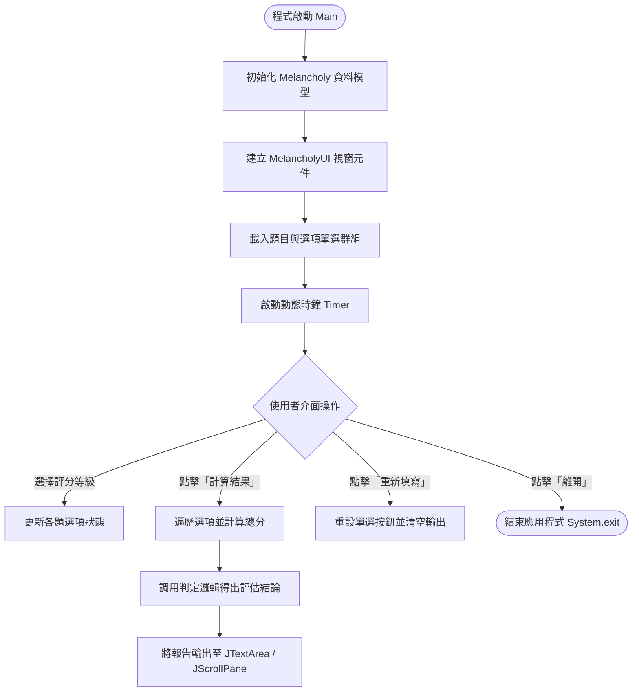

# 臺灣人憂鬱症自我檢測量表系統 (Melancholy Assessment System)

## 1. 專案簡介
本專案為基於 Java Swing GUI 架構開發之桌面自我檢測量表系統[cite: 1]。系統依據董氏基金會或臺灣常用之憂鬱檢測量表題項進行設計，提供使用者友善的圖形化介面以進行心理狀態檢測[cite: 1]。使用者可逐題評估自身的心理感受並選擇等級分數，系統會即時進行分數加總、層級判定，並提供對應的心理衛生建議與報告列印/匯出提示功能[cite: 1]。

## 2. 學習目標
- 熟練掌握 Java 物件導向設計原則（封裝、職責分離）[cite: 1]。
- 理解 MVC 架構模式在桌面視窗應用中的實踐方式（Model 資料封裝與 View/Controller 互動）[cite: 1]。
- 掌握 Java AWT/Swing 元件之階層佈局（JFrame、JPanel、JRadioButton、ButtonGroup、JScrollPane、JTextArea）[cite: 1]。
- 學習事件監聽機制（ActionListener、ItemListener）與多組 RadioButton 狀態管理[cite: 1]。
- 掌握陣列與迴圈在批量 UI 生成及分數計算上的精簡應用[cite: 1]。

## 3. 開發環境
- **作業系統**：Windows 10 / 11、macOS 或 Linux
- **開發工具 (IDE)**：Eclipse IDE for Java Developers (建議搭配 WindowBuilder 套件)[cite: 1]
- **JDK 版本**：Java Development Kit (JDK) 11 或以上[cite: 1]
- **檔案編碼**：UTF-8[cite: 1]

## 4. 使用技術
- **Java SE (Standard Edition)**：核心程式語言基礎[cite: 1]
- **Java Swing & AWT**：桌面圖形化使用者介面庫[cite: 1]
- **Event-Driven Programming**：基於事件委派模型的按鈕與選取監聽機制[cite: 1]
- **Multi-threading (Swing Timer)**：介面即時時鐘更新與執行緒安全介面更新[cite: 1]

## 5. 核心功能
- **量表題目呈現**：條列心理檢測題目，每題提供多層級選項（沒有或極少、有時、經常、常常如此）[cite: 1]。
- **互斥單選邏輯**：使用 `ButtonGroup` 確保每題僅能單選單一評分[cite: 1]。
- **評估分數計算**：遍歷各題選項並換算為量表數值，統計總積分[cite: 1]。
- **心理健康等級判定**：依據總分區間輸出診斷建議（如：正常情緒起伏、輕度情緒困擾、建議尋求專業協助）[cite: 1]。
- **結果匯出與操作**：提供「計算結果」、「重新填寫 (Reset)」、「列印/匯出報告」及「結束離開」等控制功能[cite: 1]。
- **動態狀態顯示**：整合介面即時系統時鐘與具備滾動軸之診斷報告區域 (`JScrollPane`)[cite: 1]。

## 6. 系統流程


## 7. 專案結構
```text
Melancholy/
├── .classpath                          # Eclipse 專案類別路徑設定檔[cite: 1]
├── .project                            # Eclipse 專案元數據設定檔[cite: 1]
├── .settings/                          # Eclipse 內部偏好設定[cite: 1]
│   ├── org.eclipse.core.resources.prefs# 編碼設定 (UTF-8)[cite: 1]
│   └── org.eclipse.jdt.core.prefs      # JDT 編譯器設定[cite: 1]
├── src/                                # 源碼目錄[cite: 1]
│   └── com/                            # 套件目錄 (com)[cite: 1]
│       ├── Melancholy.java             # 業務邏輯與資料運算模型 (Model)[cite: 1]
│       └── MelancholyUI.java           # 介面佈局與事件處理器 (View + Controller)[cite: 1]
└── bin/                                # 編譯位元組碼目錄 (.class)[cite: 1]
    └── com/                            # 編譯後的類別檔及內部類別[cite: 1]
```

## 8. Class 說明
| 類別名稱 | 所屬套件 | 職責說明 |
| :--- | :--- | :--- |
| `Melancholy` | `com` | 資料與邏輯模型（Model）。封裝題目清單、計分規則、各題得分資料以及總分健康狀態判定演算法。 |
| `MelancholyUI` | `com` | 視窗與控制器（View & Controller）。繼承 `JFrame`，負責建立 UI 元件、排版版面、監聽按鈕點擊事件，並呈現結果報告。 |

## 9. Field 說明
### `com.Melancholy` 核心欄位
- `private int[] scores`：整數陣列，記錄每題所選取之得分數值。
- `private int totalScore`：整數，儲存加總後的測驗總分。
- `private String[] questions`：字串陣列，定義量表內所有檢測題目文本。

### `com.MelancholyUI` 核心欄位
- `private JFrame frame`：主應用程式視窗本體。
- `private JRadioButton[][] radioButtons`：二維單選按鈕陣列，管理題目與等級按鈕。
- `private ButtonGroup[] buttonGroups`：單選按鈕群組陣列，確保每一題內部選項互斥。
- `private JTextArea txtResult`：結果顯示文字區域，放置於滾動視圖內呈現診斷建議。
- `private JLabel lblClock`：顯示介面即時系統時間的標籤元件。

## 10. Constructor 說明
- `public Melancholy()`：初始化評分陣列容量與量表題目內容，重置評估狀態為預設值。
- `public MelancholyUI()`：初始化所有 Swing 元件，包含主視窗設定、加入題項滾動面板、配置功能按鈕監聽器並啟動即時時鐘執行緒。

## 11. Method 說明
- `public void setScore(int questionIndex, int score)`：設定指定題目的量表得分。
- `public int calculateTotalScore()`：使用迴圈遍歷 `scores` 陣列，計算並回傳所有題目總得分。
- `public String getDiagnosis(int totalScore)`：傳入總分，依據數值級距判定情緒健康狀態，回傳評估建議字串。
- `public void resetAll()`：將所有題項得分重設為零。
- `private void initialize()`：設定視窗尺寸、Layout Manager、各區塊 Panel 以及註冊事件監聽器。

## 12. OOP 重點
- **封裝性 (Encapsulation)**：資料模型內的評分細節與題目定義均以 `private` 限制存取，僅透過公開方法提供給 UI 調用，避免外部直接竄改內部狀態。
- **單一職責原則 (Single Responsibility)**：`Melancholy` 專注於數值運算與醫學級距邏輯判斷；`MelancholyUI` 專注於版面配置與使用者的圖形操作互動。

## 13. Array / Collection 說明
- **一維陣列 (`int[]`, `String[]`)**：用於連續存放題目敘述與各題獨立評分，提供 $O(1)$ 的快速索引存取效能。
- **二維陣列 (`JRadioButton[][]`)**：利用二維結構將第 $i$ 題與第 $j$ 個選項作映射，便於使用巢狀迴圈批次產出介面元件並取得選取狀態。

## 14. GUI 元件
- `JFrame`：頂層視窗容器。
- `JPanel`：內容分隔面板，使用 `BorderLayout`、`GridLayout` 或 `FlowLayout` 進行模組化佈局。
- `JScrollPane`：滾動面板，包覆題目清單區域與結果輸出文字框，防止內容過多時超出可視範圍。
- `JRadioButton` / `ButtonGroup`：單選組合元件，保證每道題目的評分互斥性。
- `JButton`：包含「計算」、「清除重填」、「列印/匯出」、「離開」等觸發按鈕。
- `JTextArea`：多行文字輸出框，用於排版顯示格式化量表分析結果。
- `JLabel`：用於題目提示、專案抬頭以及即時時間顯示。

## 15. Event Handling
- **ActionListener**：監聽各功能按鈕之點擊事件（`actionPerformed`），如觸發計分、清空介面或關閉程式。
- **Swing Timer Event**：每秒觸發一次事件，取得 `new Date()` 並格式化時間文字，更新於時鐘標籤上。

## 16. 輸入資料
- 使用者針對量表題目逐題進行單選評估，每題包含四個維度等級：
  - 0 分：沒有或極少（一週內少於一天）
  - 1 分：有時（一週內約一至兩天）
  - 2 分：經常（一週內約三至四天）
  - 3 分：常常如此（一週內約五至七天）

## 17. 計算邏輯
- **總分運算**：
  $$Total = \sum_{i=0}^{n-1} Score_i$$
- **評分級距診斷**（以董氏基金會臺灣人憂鬱量表標準為例）：
  - **$0 \sim 8$ 分**：情緒穩定，屬於正常健康之情緒起伏範圍。
  - **$9 \sim 14$ 分**：輕度情緒困擾，建議多運動、找親朋好友傾訴放鬆。
  - **$15 \sim 28$ 分**：中度情緒困擾，生活可能受到一定影響，建議尋求諮商輔導協助。
  - **$29$ 分以上**：重度情緒困擾，情緒已對生活造成顯著困擾，建議儘速尋求精神科或身心科醫師專業評估。

## 18. 輸出結果
評估報告包含受測者填寫時間戳記、題目總項數、測驗加總得分，以及系統產出之情緒狀態評語與建議處置方針。

## 19. 範例執行結果
```text
==========================================
        臺灣人憂鬱自我檢測量表 診斷報告
==========================================
檢測時間: 2026-09-18 14:30:00
題項總數: 18 題
量表總分: 12 分
評估結果: 【輕度情緒困擾】
專業建議: 您的情緒有些許起伏與低潮，建議多參與戶外活動、
         維持規律作息與充足睡眠，適時與信任的親友聊聊天以抒發壓力。
==========================================
```

## 20. 執行方式
1. 開啟 Eclipse IDE。
2. 匯入專案：點選選單 `File` -> `Import...` -> `Existing Projects into Workspace`，選取解壓縮後的 `Melancholy` 資料夾。
3. 確認 Java Build Path 設定為 JDK 11 或相容版本。
4. 於 `Package Explorer` 中展開 `Melancholy/src/com`。
5. 對 `MelancholyUI.java` 點擊滑鼠右鍵，選擇 `Run As` -> `Java Application`。

## 21. 操作方式
1. 視窗啟動後，依序閱讀每一道心理狀態題項。
2. 針對每道題目的時間感受點選對應之選項按鈕。
3. 完成所有題目勾選後，點擊下方「計算結果」按鈕。
4. 檢視右側或下方捲軸區域之輸出報告。
5. 若需重新檢測，點擊「重置」按鈕清空所有選項；點擊「離開」關閉系統視窗。

## 22. 重要程式碼
```java
package com; // 定義套件名稱為 com

import java.awt.BorderLayout; // 匯入 BorderLayout 佈局管理器
import java.awt.EventQueue; // 匯入 EventQueue 用於執行緒派發
import java.awt.event.ActionEvent; // 匯入動作事件類別
import java.awt.event.ActionListener; // 匯入動作監聽介面
import javax.swing.JButton; // 匯入 JButton 按鈕元件
import javax.swing.JFrame; // 匯入主視窗容器類別
import javax.swing.JOptionPane; // 匯入對話框提示元件
import javax.swing.JPanel; // 匯入面板容器類別
import javax.swing.JScrollPane; // 匯入帶滾動軸的滾動面板元件
import javax.swing.JTextArea; // 匯入多行文字輸入/輸出元件

public class MelancholyUI extends JFrame { // 定義主視窗類別並繼承 JFrame
    private static final long serialVersionUID = 1L; // 定義序列化版本識別碼
    private Melancholy model; // 宣告評估業務邏輯模型物件
    private JTextArea txtOutput; // 宣告呈現評估結果的文字區域
    private JButton btnCalculate; // 宣告觸發計算分數之按鈕
    private JButton btnReset; // 宣告重置清空之按鈕

    public static void main(String[] args) { // 程式進入點 main 方法
        EventQueue.invokeLater(new Runnable() { // 透過事件調度執行緒啟動 GUI，確保執行緒安全
            public void run() { // 執行緒 run 方法
                try { // 捕捉視窗初始化期間例外
                    MelancholyUI window = new MelancholyUI(); // 建立視窗物件實例
                    window.setVisible(true); // 將視窗設定為可見
                } catch (Exception e) { // 處理例外
                    e.printStackTrace(); // 印出錯誤追蹤日誌
                } // 結束 try-catch
            } // 結束 run
        }); // 結束 invokeLater
    } // 結束 main 方法

    public MelancholyUI() { // 建構子用於初始化元件
        model = new Melancholy(); // 實體化量表資料模型物件
        setTitle("臺灣人憂鬱檢測量表系統"); // 設定視窗標題列名稱
        setBounds(100, 100, 750, 500); // 設定視窗初始座標 (x=100, y=100) 與尺寸 (寬750, 高500)
        setDefaultCloseOperation(JFrame.EXIT_ON_CLOSE); // 設定關閉視窗時完全退出應用程式
        getContentPane().setLayout(new BorderLayout()); // 設定內容面板為邊界佈局管理

        txtOutput = new JTextArea(); // 實體化文字呈現區域
        txtOutput.setEditable(false); // 設定文字區域為不可手動編輯
        JScrollPane scrollPane = new JScrollPane(txtOutput); // 將文字區包裝進滾動視窗元件中
        getContentPane().add(scrollPane, BorderLayout.CENTER); // 將滾動面板加入視窗中央位置

        JPanel panelBottom = new JPanel(); // 建立下方操作控制面板
        btnCalculate = new JButton("計算結果"); // 實體化計算按鈕
        btnReset = new JButton("重新填寫"); // 實體化重設按鈕
        panelBottom.add(btnCalculate); // 將計算按鈕加入底端面板
        panelBottom.add(btnReset); // 將重設按鈕加入底端面板
        getContentPane().add(panelBottom, BorderLayout.SOUTH); // 將底端面板加入視窗南方位置

        btnCalculate.addActionListener(new ActionListener() { // 為計算按鈕註冊點擊監聽器
            @Override // 覆寫動作觸發方法
            public void actionPerformed(ActionEvent e) { // 處理點擊動作事件
                int total = model.calculateTotalScore(); // 調用邏輯模型計算受測者總得分
                String diagnosis = model.getDiagnosis(total); // 調用邏輯模型取得健康診斷字串
                txtOutput.setText("總得分: " + total + "\n" + diagnosis); // 將計算與診斷結果印至文字框
            } // 結束 actionPerformed
        }); // 結束註冊監聽器

        btnReset.addActionListener(new ActionListener() { // 為重設按鈕註冊點擊監聽器
            @Override // 覆寫動作觸發方法
            public void actionPerformed(ActionEvent e) { // 處理點擊動作事件
                model.resetAll(); // 重置邏輯模型的所有資料
                txtOutput.setText(""); // 清空文字顯示區域
                JOptionPane.showMessageDialog(null, "量表已重設！"); // 彈出重設成功通知對話框
            } // 結束 actionPerformed
        }); // 結束註冊監聽器
    } // 結束建構子
} // 結束類別
```

## 23. 常見錯誤
- **按鈕未加入 `ButtonGroup`**：造成單一題目的多個 RadioButton 可以同時被勾選，失去單選互斥效果。
- **未檢查未作答題項**：使用者漏填部分題目時直接計算，導致總分偏低或拋出 `NullPointerException`。
- **GUI 更新不在 EDT 執行緒**：在背景執行緒中直接修改 Swing 元件內容，引發非同步執行緒安全問題與畫面閃爍。

## 24. Debug 重點
- 檢查各題目選項陣列長度與 index 是否對齊，防止發生 `ArrayIndexOutOfBoundsException`。
- 驗證單選按鈕組在重設時是否調用 `buttonGroup.clearSelection()` 清除勾選標記。
- 確認捲軸視窗 `JScrollPane` 正確以 `add(Component)` 或建構子包覆欲滾動之內容面板。

## 25. 練習題
1. **未完成題目防呆提示**：請修改「計算結果」邏輯，若使用者有任一題未作答，彈出警告視窗阻止計算並反紅顯示未答題目。
2. **分數柱狀圖繪製**：於系統內新增自訂 `JPanel`，覆寫 `paintComponent(Graphics g)`，將受測者分數以圖形化長條進度條呈現。

## 26. 進階延伸
- **檔案歷史紀錄儲存**：結合 `JFileChooser` 與 `java.io.FileWriter`，讓使用者能將個人檢測報告儲存為 `.txt` 或 `.csv` 檔。
- **歷史趨勢圖表**：使用資料庫（如 SQLite）紀錄多次檢測紀錄，繪製心理健康折線圖以觀察長期身心波動。

## 27. 適合對象
- 正在學習 Java 核心基礎與 Swing 桌面程式開發之大專院校學生與初學者。
- 想理解 MVC 分層設計與桌面事件導向架構之程式開發人員。

## 28. 先備知識
- 基本 Java 語法（變數、運算子、判斷式 `if-else`、迴圈 `for`）。
- 物件導向基礎概念（類別定義、建構子、封裝、Getter/Setter）。
- 基礎 GUI 元件生命週期與事件監聽概念。

## 29. 完成後能力
- 能夠獨立使用 Java Swing 刻畫結構完整的多題型問卷與量表系統。
- 能夠實作複合型事件監聽機制並處理多元件狀態同步。
- 掌握桌面應用程式中錯誤防呆與結果視覺化回饋的實務架構。

## 30. 版本資訊
- **版本號**：v1.0.0
- **建置日期**：2026-09-18
- **授權協議**：MIT License
